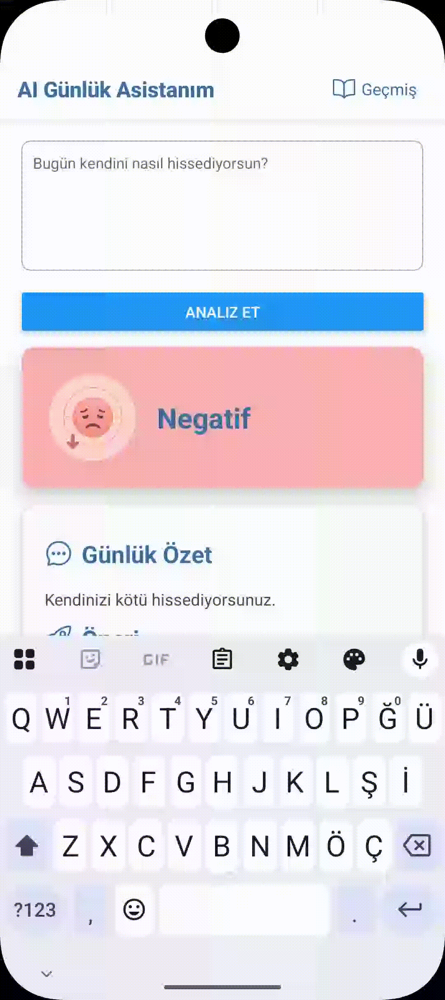
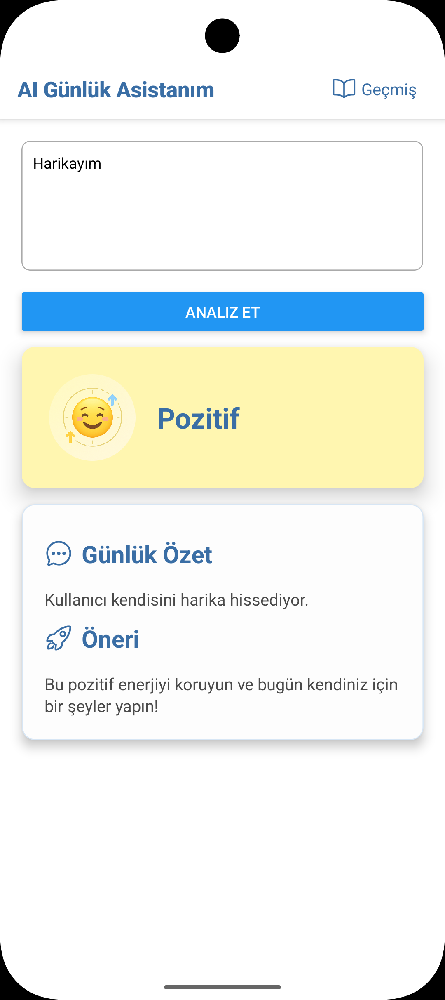
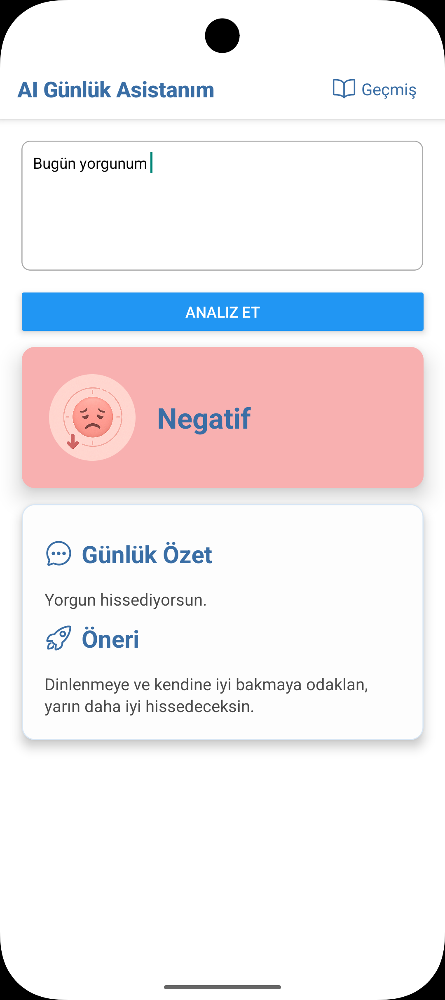

# 📘 AI Günlük Asistanım

AI Günlük Asistanım, kullanıcıların günlük duygu durumlarını analiz
eden, özetleyen ve kişiye özel öneriler sunan bir **React Native**
uygulamasıdır. Yazdığınız metni yapay zekâ ile analiz eder, öneriler
üretir ve geçmiş kayıtlarınızı saklayarak gelişiminizi takip etmenize
olanak tanır.

------------------------------------------------------------------------
## Uygulama Demo



##  Özellikler

-    **Duygu Analizi (Sentiment Analysis)**
-    **AI Öneri & Özet Üretimi**
-    **Geçmiş Kaydı (History)**
-    **Geçmiş Ekranı**
-    **Geçmiş Silme**
-    **ResultCard & SuggestionCard Bileşenleri**
-    **React Navigation Entegrasyonu**
-    **Offline Çalışma (AsyncStorage ile geçmiş erişimi)**

------------------------------------------------------------------------

##  Kullanılan Teknolojiler

-   React Native\
-   TypeScript\
-   React Navigation\
-   AsyncStorage\
-   react-native-uuid\
-   react-native-vector-icons\
-   HuggingFace / OpenAI tabanlı API servisleri

------------------------------------------------------------------------

##  AI Servisi Açıklaması

Uygulama iki farklı AI sürecini kullanır:

### **1. Duygu Analizi (Sentiment Analysis)**

Kullanıcı metni, HuggingFace veya eşdeğer ücretsiz bir sentiment modeli
üzerinden analiz edilerek:

-   positive\
-   neutral\
-   negative

etiketlerinden biri ile değerlendirilir.

### **2. AI Öneri & Özet Üretimi**

Kullanıcı metni ayrıca bir AI API'sine gönderilir (ör. OpenAI API / AI
text generator).\
Bu API aşağıdaki iki çıktıyı üretir:

-   **Özet (summary)**\
-   **Kişisel öneri (suggestion)**

API anahtarları `.env` dosyasından yönetilir.

------------------------------------------------------------------------

##  AI Araç Kullanımı

Bu proje geliştirilirken zaman zaman **ChatGPT** ve **Google AI Studio** kullanılmıştır.  
Tüm kod gözden geçirilmiş ve proje mimarisi manuel olarak düzenlenmiştir.


------------------------------------------------------------------------

## Ekran Görüntüleri






------------------------------------------------------------------------

##  Proje Yapısı

    src/
     ├── assets/
     │    ├── negatif.png
     │    └── notr.png
     │    └── pozitif.png
     ├── components/
     │    ├── ResultCard.tsx
     │    └── SuggestionCard.tsx
     │    └── AnalyzeCard.tsx
     ├── screens/
     │    ├── HomeScreen.tsx
     │    └── HistoryScreen.tsx
     ├── services/
     │    ├── Service.ts
     │    └── Recommend.ts
     └── storage/
          └── HistoryStrg.ts

------------------------------------------------------------------------

## ▶ Başlangıç

### 1. Depoyu klonlayın

    git clone https://github.com/kullanici/proje-adi.git
    cd proje-adi

### 2. Bağımlılıkları yükleyin

    npm install

### 3. iOS için (macOS)

    cd ios && pod install && cd ..

### 4. Uygulamayı başlatın

    npm run android
    npm run ios

------------------------------------------------------------------------

##  Ortam Değişkenleri

Bir `.env` dosyası oluşturun:

    OPENAI_API_KEY=YOUR_API_KEY
    HF_API_KEY=YOUR_API_KEY

Tüm API anahtarları yalnızca cihaz içinde tutulur.

------------------------------------------------------------------------

##  Ekranlar

###  HomeScreen

-   Duygu analizi\
-   AI özet & öneri\
-   Kart tabanlı sonuç gösterimi\
-   Geçmiş ekranına yönlendirme

###  HistoryScreen

-   En güncel özet & öneri kartı\
-   Tüm geçmiş listeleme\
-   Temizleme butonu ile geçmişi silme

------------------------------------------------------------------------

##  Kayıt Yapısı (HistoryItem)

``` ts
interface HistoryItem {
  id: string;
  text: string;
  sentiment: string;
  score: number;
  date: string;
  suggestion: string;
  summary: string;
}
```

AsyncStorage sayesinde **internet olmadığında bile** geçmiş
görüntülenebilir.

------------------------------------------------------------------------
